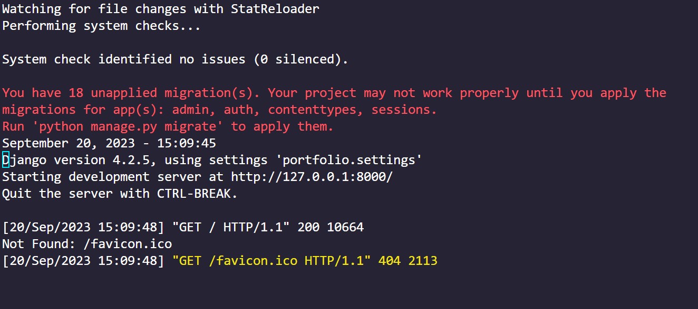
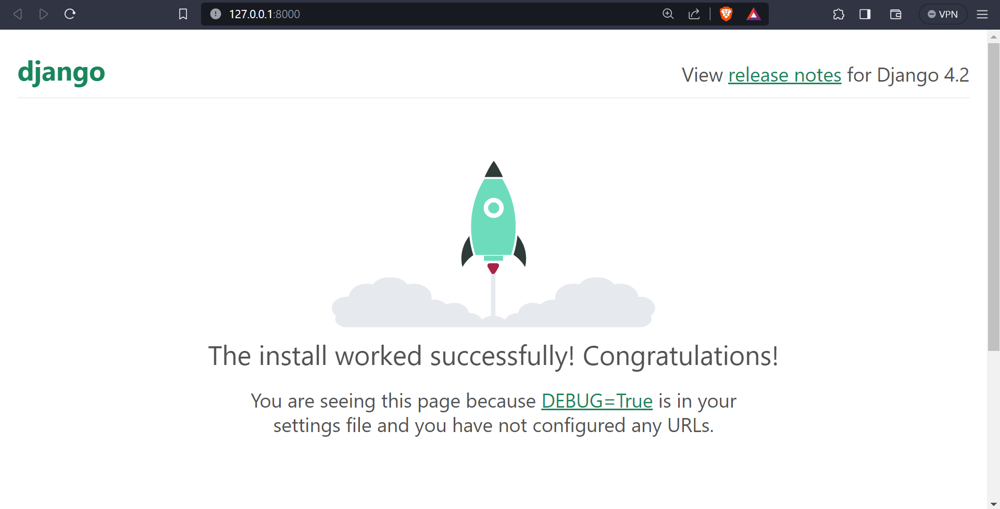

# My_Portfolio

This is my first Attemp to make a portfolio website. I've never Done something like this and I'm Hoping to make a good design using `Tailwind` or `BootStrap`. For _BackEnd_ I'll use <code><bold>Djnago</bold></code>.

**so lets go!!!**

# Backend Installation

We can divide this into two parts:

1. Bootstrap/Tailwind(FrontEnd)
2. Django(BackEnd)

We will not start from design but from the BackEnd. So lets start with Django. Because as i've learned that

> When you know what you are working with you will know how to design that.

SO, Django Backend is the feature of the project and we will start with that.

## Django Installation

So, to work with django and python we need to install python first. So, lets install python first:

- [Python](https://www.python.org/downloads/) (go to this link and download the latest version of python)

- I'm using `python 3.11.5`

After installing python we need to make a `virtual environment` for our project, so lets do that.

> A `virtual environment` is a tool that helps to keep dependencies required by different projects separate by creating isolated python virtual environments for them. This is one of the most important tools that most of the Python developers use.

So, open Your terminal and type:

- <code>python -m venv <bold>environment_name</bold></code>(replace `environment_name` with your environment name)

- I named my environment `py_env`.

Now, You'll see a folder was created automatically with the name you gave your environment. There are THousands of files inside that folder. You Don't need to worry about that.

Now, we need to `Activate` our environment. So, type:

- `environment_name\Scripts\activate` (replace `environment_name` with your environment name)

For exapmle: `py_env\Scripts\activate`

Now everything you install with `pip` will be installed in this environment and not in your global environment.

Now, we need to install `Django` in our environment. So, type:

- `pip install django`

Django will be installed in your environment. Im using `Django 4.2.5`.

You can check your django version by typing, `python -m django --version`.

Now, our environment is setup and we can start our project.

# Djnago Project Setup

Step 1: Make a directory for your project. I named my directory `My_Portfolio` and cut the `enviroment` folder and paste it in `My_Portfolio` directory.

Step 2: Open the directory in your terminal and type:

- `django-admin startproject <project_name> .` (replace `project_name` with your project name)

for example: `django-admin startproject portfolio .`

> `django-admin` is Django’s command-line utility for administrative tasks.

> `startproject` is a command that creates a folder with the name you gave and some files inside that folder, that are necessary for a django project.

> Note: The `.` at the end of the command is important. It tells the startproject command to install Django in your current directory.

After the command is executed you will see a folder named after the project name you gave. In my case it is `portfolio` and a python file named `manage.py`.

> `manage.py` is the most important file in a django project. Its used to do almost everything in a django project. SO, Don't edit or modify it ever.

Now, lets get to now the files and folders inside the `portfolio` folder.

Here, the portfolio folder is the `root` directory of our project. i'll call it `root` to avoid any confusion. It contains the following files and folders:

```
|-- root
|   |-- __init__.py
|   |-- asgi.py
|   |-- settings.py
|   |-- urls.py
|   |-- wsgi.py
```

- `__init__.py` is an empty file that tells python that this directory is a python package.

- `asgi.py` is the entry point for ASGI-compatible web servers to serve your project.

- `settings.py` is the file where you will store all the configuration for your project.

- `urls.py` is the file where you will store all the urls of your project.

- `wsgi.py` is the entry point for WSGI-compatible web servers to serve your project.

Now, lets run our project and see if everything is working fine. So, in the terminal, type:

- `python manage.py runserver` (this will run your project in your local server)

You see something like this:

- in the terminal:
  

- Copy the link and paste it in your browser. You will see something like this in the browser:
  

So if you see this, then your project is running fine. Now, lets stop the server by pressing `ctrl+c` in the terminal.

We made our project and now we need to make an app for our project. So, lets do that.

# Creating an App

Before making an app we need to know what we want to add in our project by that app.

As, this is a portfolio website, you need to add your `projects`, `skills`, `about` and `contact` information. So, we will make an app for each of them, Most importantly We need a Home page for our website. which is the First task to complete in any website. So,lets make an app for that.

SO, open up your terminal and type:

- `python manage.py startapp <app_name>` (replace `app_name` with your app name)

- i'll name my app `main`.

> `startapp` is a command that creates a folder with the name you gave and some files inside that folder, that are necessary for an app.

As the command is executed you will see a folder named after the app name you gave. In my case it is `main` and some files inside that folder.

Now, lets get to now the files and folders inside the `main` folder.

```
|-- main
|    |-- migrations
|    |    |-- __init__.py
|    |-- __init__.py
|    |-- admin.py
|    |-- apps.py
|    |-- models.py
|    |-- tests.py
|    |-- views.py

```

- `migrations` is a folder that contains all the migrations of your app.

- `__init__.py` is an empty file that tells python that this directory is a python package.

- `admin.py` is the file where you will register your models to the admin site.

- `apps.py` is the file where you will store all the configuration for your app.

- `models.py` is the file where you will store all the database models of your app.

- `tests.py` is the file where you will store all the tests of your app.

- `views.py` is the file where you will store all the views of your app.

Now, lets run our project and see if everything is working fine. So, run the server(`python manage.py runserver`) and copy the link and paste it in your browser. If you see the same page as before, then everything is working fine.

> You don't need to stop the server now. It will be running until you stop it or if you close the terminal or there is an error in your code.

Now, lets add our app to our project. Open the `settings.py` file in your root directory and find the `INSTALLED_APPS` list. Add your app name in the list. In my case it is `main`.

```python

INSTALLED_APPS = [
    'main',
    'django.contrib.admin',
    ...
]

```

Now, lets add the first `view` of our project.

> `Views` are the functions that take a `web request` and return a `web response`.

## Adding a View

### The Easy Way

Open the `views.py` file in your app directory and add the following code:

```python
from django.shortcuts import render
from django.http import HttpResponse # add

def home(request): # add
    return HttpResponse("Hello World") # add
```

> `render` is a function that takes a `request` and a `template` name and returns a `response` with that `template`.

> `HttpResponse` is a function that takes a `string` and returns a `response` with that `string`.

In the function `home` we are returning a `response` with the string `Hello World` using the `HttpResponse` function we imported.

Now, if you look at our terminal, you will see that it is running but if you go to the link we copied and paste it in our browser, you might not see the `Hello World` string.

Because we haven't added the `url` of our `view` to our `project urls`.

If you remember, when we created the root directory of our project, we got a file named `urls.py`. `urls.py` is the file that contains all the `URL Paths` of our project. So, lets add our `view` url to our `root urls`.

Open the `<root>/urls.py` file in your root directory and add the following code:

```python
from django.contrib import admin
from django.urls import path

from main import views # add

urlpatterns = [
    path('admin/', admin.site.urls),
    path('', views.home, name='home'), # add
]
```

> i imported the `views` from my `main` app.

> `path` is a function that takes a `url path`, a `view` and a `name` and returns a `url path` with that `view` and `name`.

> `name` is the string that we will use to call the `url path` in our `templates`.

So, we just imported the view from our app and added it to our `root urls` with the `url path` `''` and the `name` `home` inside the `urlpatterns` list.

now just restart the server and go to the link and you will see the `Hello World` string.

> Before connecting the view to the `''` path the global django template was showing. Now, we are returning a `response` with the `Hello World` string. So, the global django template is not showing anymore.

This is one way to add a `view` in our website but we will not be using this method because the `urlpath` can become very long and messy. So, we will be using `include` to add our `views` to our `root urls`.

### The Better Way

first lets go to our `main app` and create a file named `urls.py` and add the following code:

```python
+ from django.urls import path #add
+ from . import views #add

+ urlpatterns = [ #add
+    path('', views.home, name='home'), #add
+]
```

> As we are in the `main app` we don't need to import the `views` from the `main` app. We can just import it from the current directory. So, we used `from . import views`.

> all the other things are same as the `root urls`. we didn't add the `admin` url because we don't need it in our `main app`.

Now we can add our `main app urls` to our `root urls`. So, open the `<root>/urls.py` file in your root directory and add the following code:

```python
from django.contrib import admin
from django.urls import path, include # add
# from main import views #

urlpatterns = [
    path('admin/', admin.site.urls),
    path('', include('main.urls')), # add
    #path('', views.home, name='home'),
]
```

> `include` is a function that takes a `url path` and a `app urls` and returns a `url path` with that `app urls`.

> `main.urls` is the `urls.py` file we created in our `main app` and `include` will add all the `url paths` of that file to our `root urls`.

I removed the `views` import because we don't need it anymore. We are using `include` to add our `main app urls` to our `root urls`.

So if you did all that accordingly, when you go to the link we will see the `Hello World` string.

Now, lets test the `urls path` we created. So, in the `main app urls` add the following code:

```python

...
urlpatterns = [
    path('home/', views.home, name='home'),
]
```

> don't forget to add `"/"` after `home` in the `url path`. might cause some nasty errors

> just changed the `url path` from `''` to `'home'`.

Now, when you reload your browser you will see an error. Because we changed the `url path`. But no need to panic.

> `Django` is smart enough to tell you what the error is. So, read the error carefully and you will know what to do.

So, the error is saying that the `page not found`. Because we changed the page's url path. Before, it was `''` which refered the local host address(in my case it was `http://127.0.0.1:8000/`)

But as we changed the `url path` to `home` it is now `http://127.0.0.1:8000/home/`.

> so every path referes to the `LocalHostAddress/<path>`.

Now, In the Browser type in the path after the `LocalHostAddress` and you will see the `Hello World` string.

for example: in my case it is `http://127.0.0.1:8000/home/`

You will see the `Hello World` string.

So, As we are done with how to add a `view` to our project and how to add `url paths` to our `root urls` we can move on to the next step. Before lets reset the url path to `''` in the `main app urls`.

```python
...
urlpatterns = [
    path('', views.home, name='home'),
]
```

## Adding a Template

### making the Home Page

By adding a template i mean we will add a `html` file to our project and we will render that `html` file using in views.

So, we will start by creating a folder named `templates` in our `main app` and inside that folder we will create another folder named `main` and inside that folder we will create a `html` file named `home.html`.

So, the directory structure will look like this:

```
|-- main
|    |-- migrations
|    |    |-- __init__.py
|
|    |-- templates
|    |    |-- main
|    |    |    |-- home.html
|
|    |-- __init__.py
|    |-- admin.py
|    |-- apps.py
|    |-- models.py
|    |-- tests.py
|    |-- views.py

```

> Make sure the name `templates` is correct. If you misspell it, it will not work.

I know this is a little bit confusing but this is how django works. You will get used to it, as we go on.

So now, lets add some code to our `home.html` file.

```html
<!DOCTYPE html>
<html lang="en">
  <head>
    <meta charset="UTF-8" />
    <meta name="viewport" content="width=device-width, initial-scale=1.0" />
    <title>Document</title>
  </head>
  <body>
    <h1>Hello World</h1>
  </body>
</html>
```

Now, lets render this `html` file in our `home` view. So, open the `views.py` file in your app directory and add the following code:

```python
def home(request):
    #return HttpResponse("Hello World")
    return render(request, 'main/home.html') # add
```

> `render` is a function that takes a `request` and a `template` name and returns a `response` with that `template`.

> here we are returning a `response` with the `home.html` template by giving the `template` path `main/home.html`. I didn't add the `templates` folder name because django will automatically look for the `templates` folder in the `main app`.

Now, if you reload your browser you will see the `Hello World` string. But this time it is coming from the `home.html` template.

I think it was easy to add and render a `template` in our `view` and we will be doing this a lot in our project.

I dont like the `Hello World` string. So, lets change it to something else.

```html
<!DOCTYPE html>
<html lang="en">
  <head>
    <meta charset="UTF-8" />
    <meta name="viewport" content="width=device-width, initial-scale=1.0" />
    <title>Document</title>
  </head>
  <body>
    <h1>Home page</h1>
    <!-- changed to home -->
  </body>
</html>
```

So, as we made our first template view and render our first web page, we can now follow the same steps to add another `view` and `template`.

### Adding the About Page

So, lets add another `view` and `template` for our `about` page.

In the `main/templates/main` folder create a `html` file named `about.html` and add the following code:

```html
<!DOCTYPE html>
<html lang="en">
  <head>
    <meta charset="UTF-8" />
    <meta name="viewport" content="width=device-width, initial-scale=1.0" />
    <title>Document</title>
  </head>
  <body>
    <h1>About</h1>
  </body>
</html>
```

Now, lets add a `view` for our `about` page. So, open the `views.py` file in your app directory and add the following code:

```python
...
def home(request):
    return render(request, 'main/home.html')

def about(request):
    return render(request, 'main/about.html')
```

Now, lets add the `url path` for our `about` page. So, open the `main/urls.py` file in your app directory and add the following code:

```python
...
urlpatterns = [
    path('', views.home, name='home'),
    path('about/', views.about, name='about'), # add
]
```

Now, if you reload your browser and go to the `localhost/about` page you will see the `About page`.

SOOOOOOOO, The steps of adding a `view` and `template` are:

1. Create a `html` file in the `templates` folder.
2. Add a `view` in the `views.py` file.
3. Add a `url path` in the `urls.py` file.

We will follow these steps to render any page in our project.

Now lets make it a little bit more interesting. Lets add a `navbar` to our project.

## Adding a Navbar

Adding a `navbar` is very easy. We just need to add some `html` code to our `Home.html` file. So, lets do that.

```html
<body>
  <!-- navbar without css !-->
  <nav>
    <a href="#">Home</a>
    <a href="#">About</a>
    <a href="#">Skills</a>
    <a href="#">Projects</a>
  </nav>
  <h1>Home page</h1>
</body>
```

Now, if you reload your browser you will see the `navbar` in the top of the page. But it is not looking good. But again there is a problem.

**WE NEED TO ADD THE SAME `NAVBAR` TO EVERY PAGE OF OUR PROJECT.**

Thats a very annoying thing to do. So, we need to find a way to add the `navbar` to every page of our project without adding it to every page.

**There is a solution to this problem.**

It is called **`TEMPLATE INHERITANCE`**.

### Template Inheritance

Template inheritance is a very useful feature of Django that allows you to build a base “skeleton” template that contains all the common elements of your site and defines blocks that child templates can override.

So, here the `navbar` is the common element. So, we will make a html file that will contain the `navbar` and we will extend that file in every page of our project.

#### Making the Base Template

To do that lets make a directory name `templates` in our project directory and inside that folder we will make a file named `base.html` which will contain the navbar.

The file structure will look like this:

```
path/to/the/project
|-- main
|-- portfolio(root directory)
|-- templates
|    |-- base.html
```

> the templates folder is in my `project directorty` or the `base directory`, Not in main or root directory.

Now, lets add the `navbar` to our `base.html` file.

```html
<!DOCTYPE html>
<html lang="en">
  <head>
    <meta charset="UTF-8" />
    <meta name="viewport" content="width=device-width, initial-scale=1.0" />
    <title>Document</title>
  </head>
  <body>
    <!-- navbar without styling-->
    <nav>
      <a href="#">Home</a>
      <a href="#">About</a>
      <a href="#">Skills</a>
      <a href="#">Projects</a>
    </nav>
  </body>
</html>
```

> Here is the navbar we made before in home.html.

> `href="#"` is used to tell the browser to stay on the same page. Because we don't have any other pages yet.

Now, we need to tell django that this is the `base` template.

#### Adding the Base Template

So, open the `settings.py` file in your root directory and find the `TEMPLATES` variable and add the following code:

```python
...
TEMPLATES = [
    {
        'BACKEND': 'django.template.backends.django.DjangoTemplates',
        'DIRS': [BASE_DIR / 'templates'], # add
        'APP_DIRS': True,
        ...
    },
]
...
```

> `DIRS` is a list of directories where django will look for the templates.

> restarting the server might be needed because we are editing directly in the `settings.py`.

Now, lets extend the `base.html` file in our `home.html` file. So, open the `home.html` file in your `main/templates/main` directory, remove everything and add the following code:

```html

```

> `` is used to tell django that this is the `base` template.

Now, if you reload your browser you will see the `navbar` in the top of the page.

But this time it is coming from the `base.html` template.

we can add this to the `about.html` file.

```html

```

now, if we go to the about page we will see the `navbar` in the top of the page.

So, we have added the `navbar` to every page of our project.

but if we add some more code inside the `home.html` file we will see the `navbar` in the top of the page but nothing else.

lets, do some experiments.

```html


<h1>HOME PAGE</h1>
<!-- add -->
```

Now if we reload our browser we will see the `navbar` in the top of the page but the `h1` tag is not there.

#### why is this happening?

Because we are extending the `base.html` template.
When the extends tag is used django identifies the `base.html` as the parent template and the `home.html` as the child template.

This means the `home.html` is a part of the `base.html` template.

When i wrote the `h1` tag inside the `home.html` it was outside the `base.html` template.

So, we need to add the `h1` tag inside the `base.html` template.

**How can we do that?**

lets modify the `base.html` file.

```html
...
<body>
  <!-- navbar without stling-->
  <nav>
    <a href="#">Home</a>
    <a href="#">About</a>
    <a href="#">Skills</a>
    <a href="#">Projects</a>
  </nav>
  <!-- add -->
  <div>
    
    <!-- content goes here -->
    
  </div>
</body>
...
```

> `` is used to tell django that this is the `block` of the `base.html` template.

> `block` is a django template tag that is used to define a `block` in a template.

> `content` is the name of the `block`.

> `block` is used to define a `block` in a template and `endblock` is used to end the `block`.

I just added a `div` tag. Inside the `div` tag I added the `` tag.

now, lets go to the `home.html` file and add the following code:

```html
 

<!-- content of the home page -->

<h1>HOME PAGE</h1>

```

> here in the `home.html` `` is used to tell django that this is the `block` of the `home.html` template.

After adding the `block` in the `home.html` file, if we reload our browser we will see the `navbar` in the top of the page and the `h1` in the page.

Now, lets do the same for the about page.

```html
 
<!-- content of the about page -->

<h1>About</h1>

```

with that we have added the `navbar` to every page of our project and we have learned how to use `template inheritance`.
